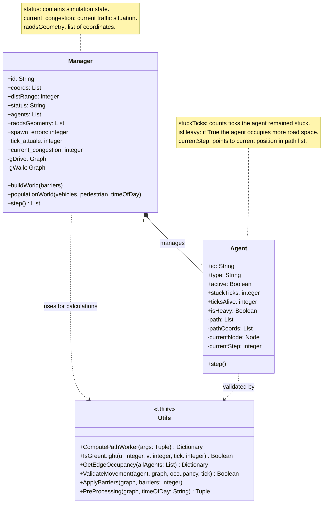
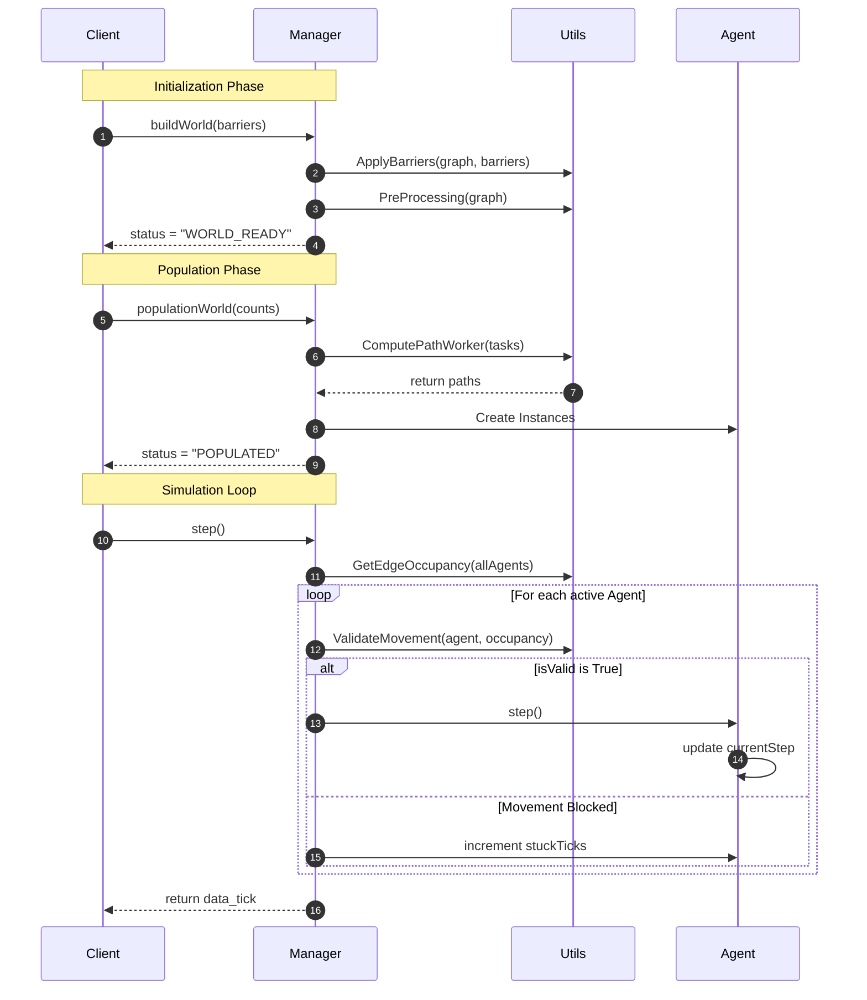

### *UML Class Diagram*



### *Sequence Diagram*



### *State Diagram*

```mermaid
stateDiagram-
    direction TB

    [*] --> CREATED : Manager() Initialization
    
    state CREATED {
        direction TB
        State_1: Waiting for buildWorld()
        State_2: Running ApplyBarriers()
        State_3: Running PreProcessing()
        
        State_1 --> State_2
        State_2 --> State_3
    }

    CREATED --> WORLD_READY : status = "WORLD_READY"
    
    state WORLD_READY {
        direction TB
        State_4: Waiting for populationWorld()
        State_5: Running ComputePathWorker()
        State_6: Initializing Agent Instances
        
        State_4 --> State_5
        State_5 --> State_6
    }

    WORLD_READY --> POPULATED : status = "POPULATED"

    state RUNNING {
        direction TB
        Step_Update: tick_attuale++
        
        Traffic_Scan: GetEdgeOccupancy(allAgents)
        
        Validation: ValidateMovement(agent, occupancy)
        
        Movement: Agent.step() OR stuckTicks++
        
        Step_Update --> Traffic_Scan
        Traffic_Scan --> Validation
        Validation --> Movement
        Movement --> Step_Update : Next Tick Loop
    }

    POPULATED --> RUNNING : status = "RUNNING" (first step call)
    
    RUNNING --> FINISHED : All Agents active = False
    FINISHED --> [*]
