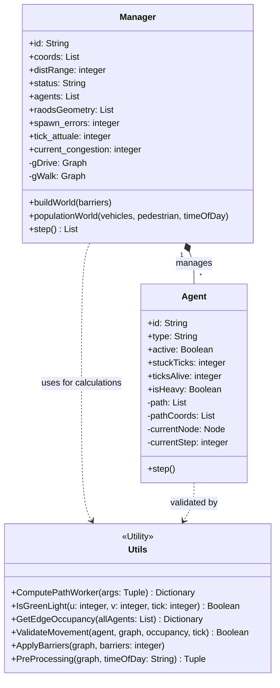
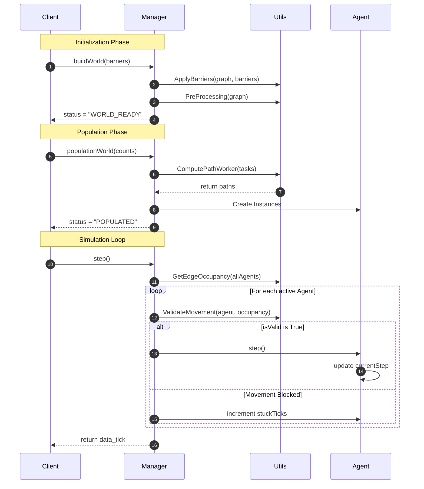

### *UML Class Diagram*


The Manager class is responsible for coordinating the entire simulation lifecycle, from world creation to the management of individual ticks. The road graphs—gDrive, specialized for vehicles, and gWalk, specialized for pedestrians—are obtained using the OSMnx (OpenStreetMap) library. The road geometry (roadsGeometry) is generated by extracting the coordinates of nodes and edges, allowing the Client to render the map without processing the entire graph object.

Each Agent represents an entity within the Manager. While the path is obtained through Dijkstra's algorithm, the object also requires pathCoords (the actual geographic coordinates of those nodes) to move spatially. The isHeavy attribute determines the agent's impact on traffic: if an agent is "heavy" (e.g., a truck), its contribution to road congestion is greater. This data is essential during the GetEdgeOccupancy phase to determine the "weight" or load of a specific road. Additionally, stuckTicks acts as an accumulator that increments every time the Manager denies an Agent's movement.

The Utils class provides a set of mathematical rules and logic consulted by the Manager. ComputePathWorker fetches the OpenStreetMap data and calculates the fastest route using Dijkstra's algorithm; if a road is inaccessible, the Manager reports it.
isGreenLight manages the rhythm of traffic lights based on the current tick, while ValidateMovement blocks an agent if the road ahead has reached its capacity. GetEdgeOccupancy tracks the number of vehicles on each road segment, giving more weight to heavy vehicles to identify where bottlenecks form. Finally, ApplyBarriers physically removes connections (e.g., roads closed for construction), while PreProcessing shifts traffic toward points of interest in the morning and toward the outskirts in the evening, a behavior modeled by the timeOfDay variable.

### *Sequence Diagram*



### *State Diagram*

```mermaid
stateDiagram-v2
    direction TB

    [*] --> CREATED : Manager() Initialization
    
    state CREATED {
        direction TB
        State_1: Waiting for buildWorld()
        State_2: Running ApplyBarriers()
        State_3: Running PreProcessing()
        
        State_1 --> State_2
        State_2 --> State_3
    }

    CREATED --> WORLD_READY : status = "WORLD_READY"
    
    state WORLD_READY {
        direction TB
        State_4: Waiting for populationWorld()
        State_5: Running ComputePathWorker()
        State_6: Initializing Agent Instances
        
        State_4 --> State_5
        State_5 --> State_6
    }

    WORLD_READY --> POPULATED : status = "POPULATED"

    state RUNNING {
        direction TB
        Step_Update: tick_attuale++
        
        Traffic_Scan: GetEdgeOccupancy(allAgents)
        
        Validation: ValidateMovement(agent, occupancy)
        
        Movement: Agent.step() OR stuckTicks++
        
        Step_Update --> Traffic_Scan
        Traffic_Scan --> Validation
        Validation --> Movement
        Movement --> Step_Update : Next Tick Loop
    }

    POPULATED --> RUNNING : status = "RUNNING" (first step call)
    
    RUNNING --> FINISHED : All Agents active = False
    FINISHED --> [*]
