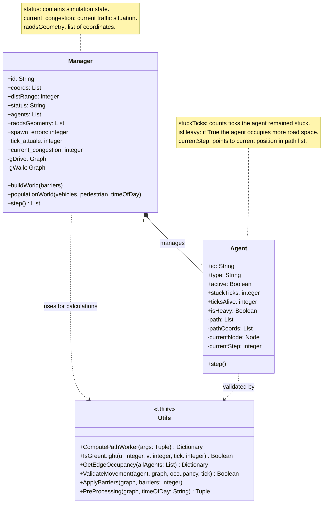

### **UML Class Diagram**



### *Sequence Diagram*

```mermaid

sequenceDiagram
    participant Client
    participant Manager
    participant Utils
    participant Agent

    Client->>Manager: step()
    Manager->>Manager: increment tick_attuale

    Manager->>Utils: GetEdgeOccupancy(allAgents)
    Utils-->>Manager: return current_congestion (Dictionary)
    end
