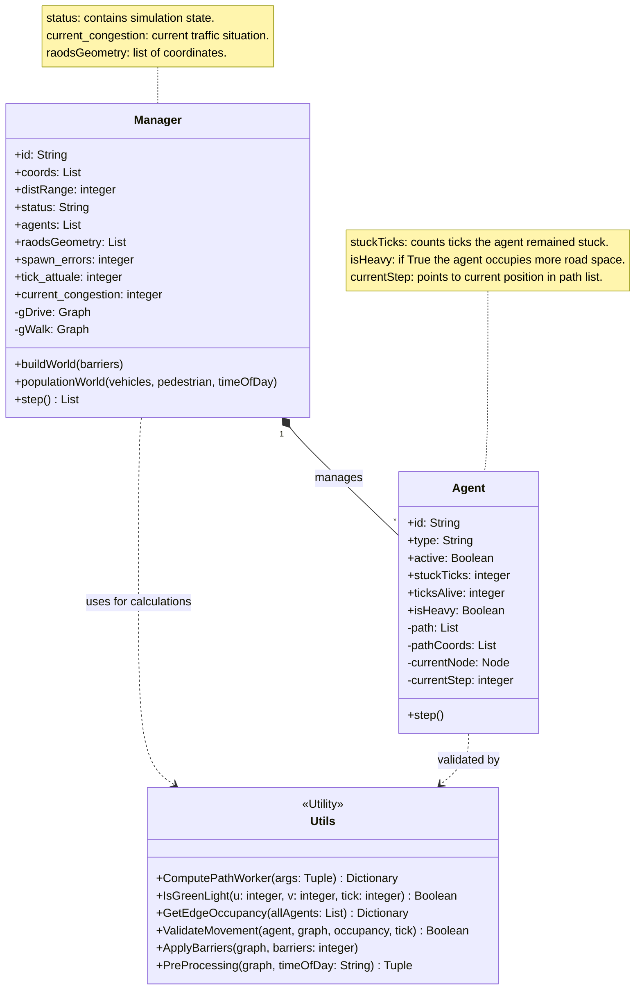
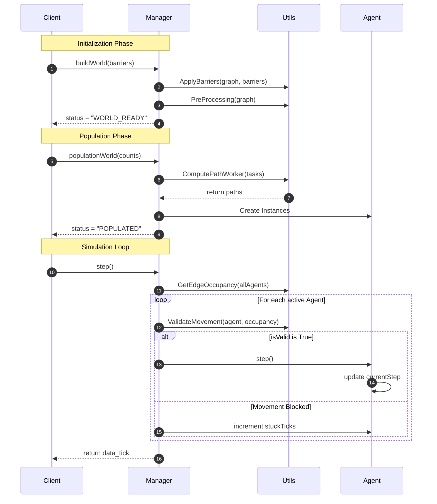

### *UML Class Diagram*



### *Sequence Diagram*



### *State Diagram*

```mermaid
stateDiagram-v2
    direction TB

    [*] --> CREATED : Instance initialized
    
    state CREATED {
        direction TB
        [*] --> gDrive_None
        gDrive_None --> ApplyBarriers : buildWorld(barriers)
        ApplyBarriers --> PreProcessing : Weights & Capacity
        Note right of PreProcessing : Calculates road capacity<br/>and timeOfDay weights.
    }

    CREATED --> WORLD_READY : status = "WORLD_READY"

    state WORLD_READY {
        direction TB
        [*] --> agents_Empty
        agents_Empty --> ComputePathWorker : populationWorld(counts)
        Note left of ComputePathWorker : Parallel Dijkstra paths<br/>Increments spawn_errors
        ComputePathWorker --> agents_Created : Agent instances
    }

    WORLD_READY --> POPULATED : status = "POPULATED"

    state RUNNING {
        direction TB
        [*] --> GetEdgeOccupancy : step() every 5 ticks
        
        state ValidateMovement_Logic {
            direction TB
            [*] --> IsGreenLight
            IsGreenLight --> CapacityCheck : if Green
            CapacityCheck --> MovementResult : if space exists
        }
        
        GetEdgeOccupancy --> ValidateMovement_Logic
        MovementResult --> GetEdgeOccupancy : tick_attuale++
    }

    POPULATED --> RUNNING : status = "RUNNING"
    
    RUNNING --> FINISHED : all agents inactive
    FINISHED --> [*]
