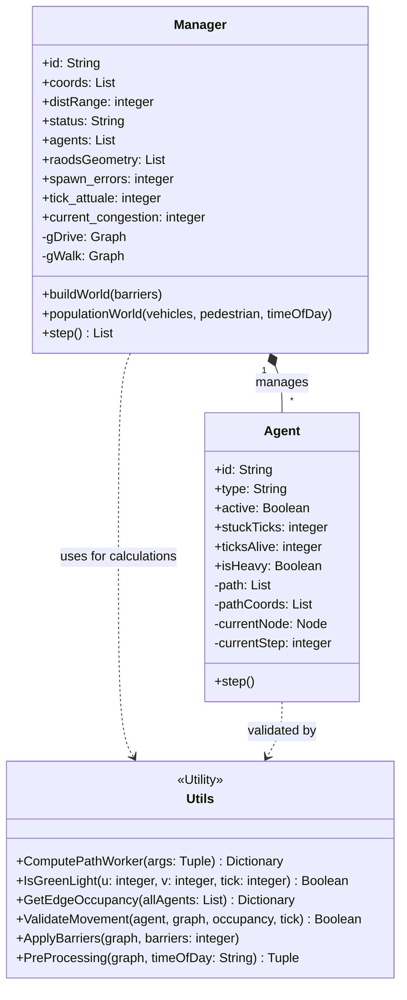
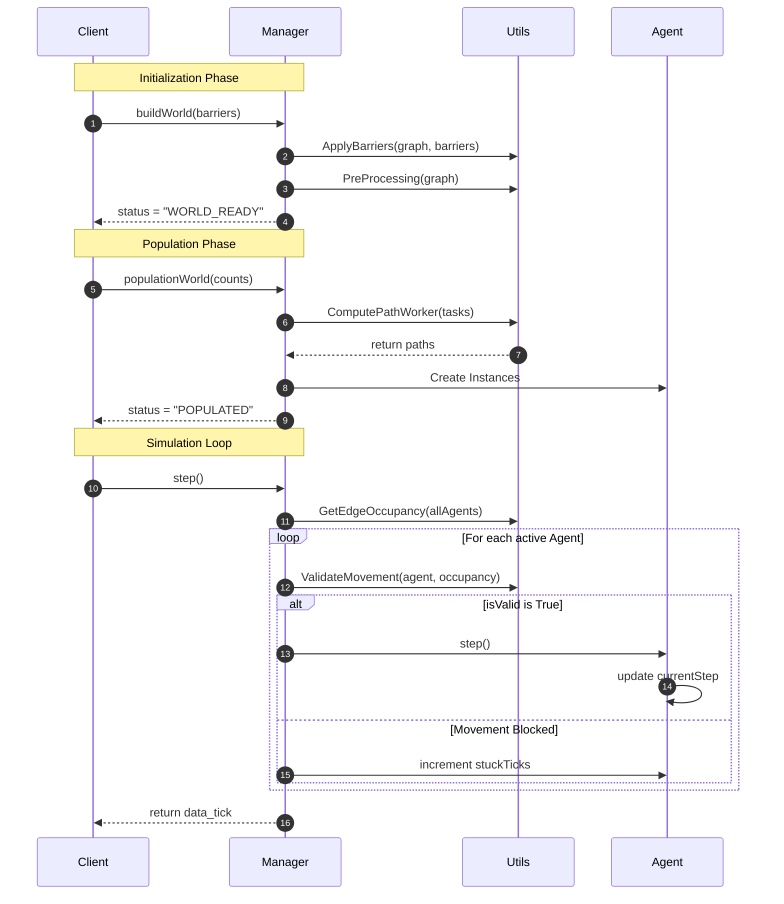

### *UML Class Diagram*


The Manager class runs the whole simulation, handling everything from building the world to keeping track of each tick. It grabs two road graphs from OSMnx (the OpenStreetMap library): gDrive for cars and gWalk for pedestrians. To keep things light for the Client, it pulls just the coordinates from these graphs—this way, the Client can render maps fast without having to load the full graph. 

Agents are the different entities managed by the Manager. Each agent follows a path found by Dijkstra’s algorithm, but they also need the actual coordinates (pathCoords) of that route to move around the world. The isHeavy attribute marks whether an agent, like a truck, puts more strain on traffic. This detail matters when you want to figure out how congested a given road is during GetEdgeOccupancy, since heavy agents add more load. The stuckTicks counter goes up whenever the Manager can’t let an agent move, tracking how long it spends blocked. 

The Utils class is packed with the math and logic the Manager needs. ComputePathWorker fetches map data and figures out the shortest routes using Dijkstra’s algorithm, and if a road is blocked, the Manager flags it. isGreenLight handles how traffic lights switch depending on the simulation tick. ValidateMovement steps in to stop an agent if its next road is packed already. GetEdgeOccupancy checks how many vehicles are on each piece of road, bumping up the count for heavy vehicles so it’s easy to spot upcoming traffic jams. ApplyBarriers takes out entire road connections, which you’d do for things like construction closures. PreProcessing nudges traffic toward busy spots in the morning and out to the edges later, using timeOfDay to set this morning/evening shift in behavior.

### *Sequence Diagram*


*Fase di initalizzazione*: tutto parte dal comando buildWorld inviato dal client. Il manager non esegui i calcoli geografici direttamente, ma delega alcune responsabilità alla classe Utils. Successivamente viene chiamata la funzione ApplyBarriers per tagliare i collegamenti del grafo dove l'utente ha inserito ostacoli, e successivamente viene chiamata la funzione PreProcessing per impostare i pesi stradali in base alla fascia oraria scelta (mattina/sera). Solo quando i grafi sono pronti, il Manager conferma al Client che il motore si trova in stato di "WORLD_READY"

*Fase di popolamento*: questa è la fase più onerosa per la CPU. Il Manager delega ancora una volta questo lavoro alla classe Utils, più precisamente alla funzione ComputePathWorker. Qui viene sfruttato l'algoritmo di Dijkstra per calcolare i cammini minimi su migliaia di nodi contemporaneamente. 
Non tutti i percorsi sono garantiti, se le barriere inserite dal Client hanno isolato una zona, un agente potrebbe non riuscire ad indivduare un percorso valido e di conseguenza non verrebbe creato, il sistema lo rileva e incrementa il contatore spawn_errors, evitando il crash della simulazione. 
Solo dopo aver ottenuto tutti i percorsi validi, il Manager istanzia gli ogetti Agent, assegniano a ciascuno un percorso. Quando ogni attore è pronto, il Manager aggiorna il suo stato in "POPULATED", segnalando al Client che la simulazione è pronta per essere eseguita.


### *State Diagram*

```mermaid
stateDiagram-v2
    direction TB

    [*] --> CREATED : Manager() Initialization
    
    state CREATED {
        direction TB
        State_1: Waiting for buildWorld()
        State_2: Running ApplyBarriers()
        State_3: Running PreProcessing()
        
        State_1 --> State_2
        State_2 --> State_3
    }

    CREATED --> WORLD_READY : status = "WORLD_READY"
    
    state WORLD_READY {
        direction TB
        State_4: Waiting for populationWorld()
        State_5: Running ComputePathWorker()
        State_6: Initializing Agent Instances
        
        State_4 --> State_5
        State_5 --> State_6
    }

    WORLD_READY --> POPULATED : status = "POPULATED"

    state RUNNING {
        direction TB
        Step_Update: tick_attuale++
        
        Traffic_Scan: GetEdgeOccupancy(allAgents)
        
        Validation: ValidateMovement(agent, occupancy)
        
        Movement: Agent.step() OR stuckTicks++
        
        Step_Update --> Traffic_Scan
        Traffic_Scan --> Validation
        Validation --> Movement
        Movement --> Step_Update : Next Tick Loop
    }

    POPULATED --> RUNNING : status = "RUNNING" (first step call)
    
    RUNNING --> FINISHED : All Agents active = False
    FINISHED --> [*]
