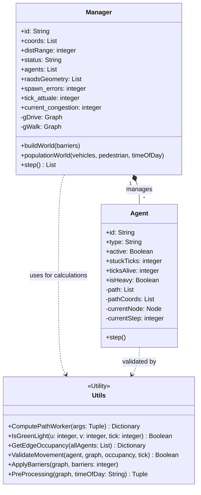
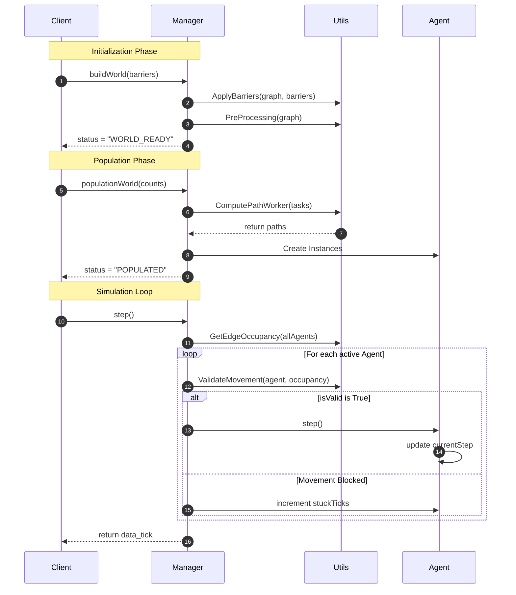

### *UML Class Diagram*


Il compito della classe Manager è quello di coordinare l'intero ciclo di vita della simulazione, dalla creazione del mondo alla gestione dei singoli ticks. I grafi stradali gDrive, specializzato per i veicoli, e gWalk,specializzato per i pedono, sono ricavati tramite la librearia OSMnx (OpenStreetMap). La geometria stradale (roadsGeometry) viene ottenuta estrando le coordinate dei nodi e degli archi per permettere al Client di disengare le strade senza processare l'intero oggetto grafo.   
Ogni Agent rappresenta un'entità dentro il Manger. il path è ottenuto tramite l'algoritmo di Dijkstra, tuttavia l'oggetto necessita per muoversi anche di pathCoords, ovvero le coordinate geografiche reali di quei nodi. isHeavy determina l'impatto dell'agente sul traffico, se un agente è pesante (es. camion), il suo contributo alla congestione stradale è maggiore, questo dato è fondamentale durante la fase di GetEdgeOccupancy per capire il peso di una strada. stuckTicks è un accumultaore, ogni volta che il Manager nega un movimento a un Agent, stuckTicks aumenta. 
Le Utils sono un insieme di regole matematiche che il Manager consulta. ComputePathWorker prende la mappa di OpenStreetMap e calcola la strada più veloce usando l'algoritmo di Dijkstra. Se una strada è chiusa il Manager lo segnala.<br/>
isGreenLight gestisce il ritmo dei semafori in base al tempo, mentre ValidateMovement blocca un agent se la stra davanti è già troppo piena. GetEdgeOccupancy conta quanti veicoli ci sono su ogni segmento di strada, dando un peso maggiore ai mezzi pesanti per capire dove si formano gli ingorghi. ApplyBarriers elimina fisicamente i collegamenti, ad esempio strade chiuse per lavori, mentre PreProcessing concentra il traffico verso punti di interesse durante la mattina mentre si concentra verso la perifieria la sera, questa situazione è modellata dalla variabile timeOfDay. 


### *Sequence Diagram*



### *State Diagram*

```mermaid
stateDiagram-v2
    direction TB

    [*] --> CREATED : Manager() Initialization
    
    state CREATED {
        direction TB
        State_1: Waiting for buildWorld()
        State_2: Running ApplyBarriers()
        State_3: Running PreProcessing()
        
        State_1 --> State_2
        State_2 --> State_3
    }

    CREATED --> WORLD_READY : status = "WORLD_READY"
    
    state WORLD_READY {
        direction TB
        State_4: Waiting for populationWorld()
        State_5: Running ComputePathWorker()
        State_6: Initializing Agent Instances
        
        State_4 --> State_5
        State_5 --> State_6
    }

    WORLD_READY --> POPULATED : status = "POPULATED"

    state RUNNING {
        direction TB
        Step_Update: tick_attuale++
        
        Traffic_Scan: GetEdgeOccupancy(allAgents)
        
        Validation: ValidateMovement(agent, occupancy)
        
        Movement: Agent.step() OR stuckTicks++
        
        Step_Update --> Traffic_Scan
        Traffic_Scan --> Validation
        Validation --> Movement
        Movement --> Step_Update : Next Tick Loop
    }

    POPULATED --> RUNNING : status = "RUNNING" (first step call)
    
    RUNNING --> FINISHED : All Agents active = False
    FINISHED --> [*]
